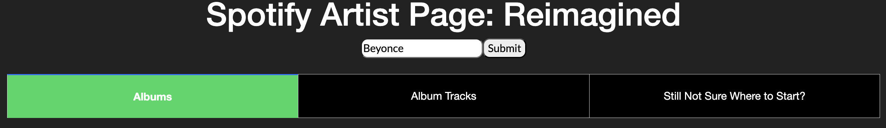
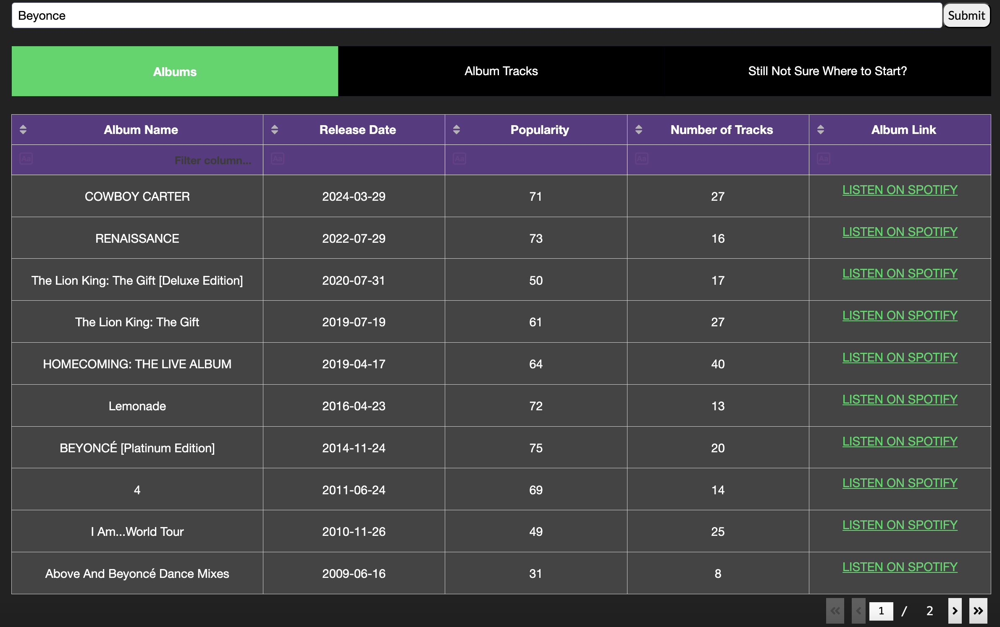
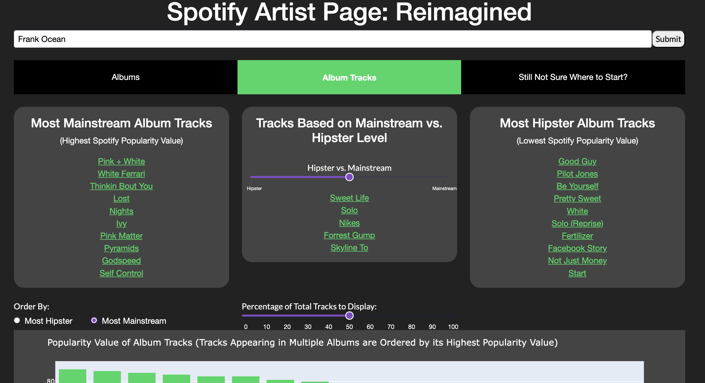
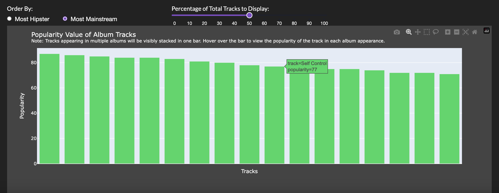
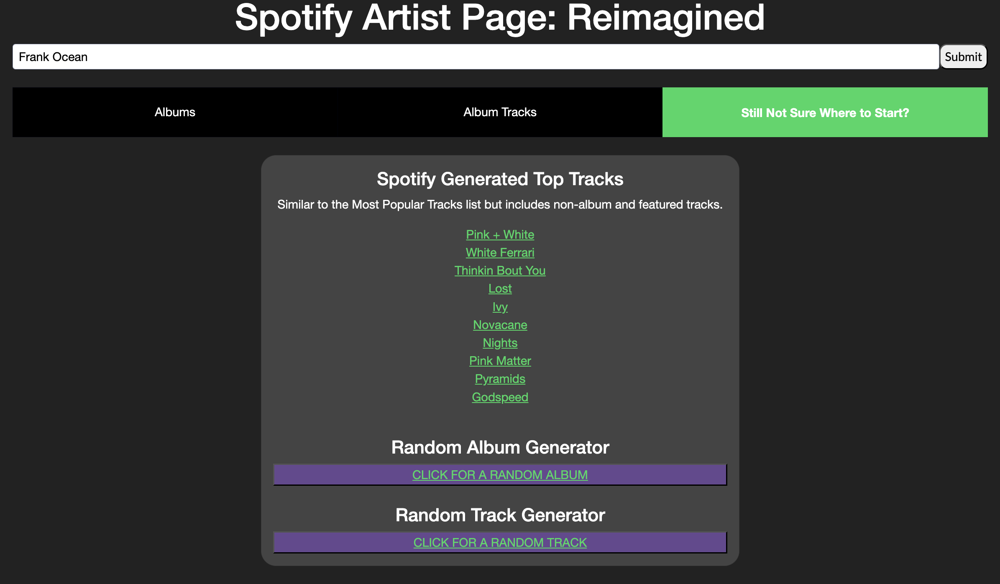

# Spotify Artist Page: Reimagined
A reimagined Spotify Artist Explore Page where you can search album and track information for any artist. The <a href="https://developer.spotify.com/documentation/web-api">Spotify Web API</a>  was used to gather album and track information. Information was requested for the following endpoints: Get Artist, Get Artist's Albums, Get Artist's Top Tracks, Get Album, Get Album Tracks, and Get Track. 

## Why Did I Make this Page?
Sometimes I find that I don't know where to start when wanting to explore the music of a new artist. The artist's page on Spotify begins with a list of 10 of their currently most popular tracks, and is followed by a list of their discography and some playlists they are featured in. I find at first glance, it can be difficult to know where to start, especially if they have a lot of albums!. 

I created a reimagined Spotify Artist Explore Page to helps users decide where to start when exploring a new artist. It has a lot of the same components seen on Spotify, but focuses more on exploring artist albums and tracks from their albums. I wanted this page to focus on albums, and tracks found in their albums (not so much songs they are featured in, extra singles, or from compilation albums), since I feel albums show more of the artists artistic/musical vision. Personally, I prefer listening to albums over playlists since I like exploring overarching themes, transitions, and sounds across tracks in an album. This reflects how I approached the layout and focus of this page. 

The criteria used to organize these songs and tracks is somewhat based on Spotify's popularity score which is defined on the Spotify Web API page as: 

"The popularity of a track is a value between 0 and 100, with 100 being the most popular. The popularity is calculated by algorithm and is based, in the most part, on the total number of plays the track has had and how recent those plays are. Generally speaking, songs that are being played a lot now will have a higher popularity than songs that were played a lot in the past. Duplicate tracks (e.g. the same track from a single and an album) are rated independently. Artist and album popularity is derived mathematically from track popularity. Note: the popularity value may lag actual popularity by a few days: the value is not updated in real time."

Using the popularity value as a factor for which tracks (and albums) to display means that the page is not tailored to the specific user. This page is meant to provide a general introduction to tracks (and albums) from an artist that are likely considered fan favourites. This is a good way to get an introduction to elements of an artist's music that appeals to their fans. If users want to explore an artists less popular work, this can be done by listening to the tracks and albums with a lower popularity score (i.e. the more "hipster" tracks as seen in the page).

## Project Components
There are 3 tabs: "Albums", "Top Tracks", and "Still Not Sure What to Pick?". 

### Albums Tab
The first tab "Albums" contains a table where you can sort all the artists albums based on "popularity", album length, and release date. This allows users to find an album that aligns with how they want to explore an artists music (unfortunately I can no longer access genre information for an album, that would have been great to add). In addition to sorting, users can filter based on specific conditions. For example, users can filter for albums that have a popularity value above or below a specific number by typing in the "Filter column..." cell in each column (e.g. > 60, < 70, or 50 >= etc.), or filter for albums above or below a specific number of tracks, or albums that were released at a specific year. At the right end of the table, there is a column with links at which the user can click to listen to their album of choice on Spotify.

### Tracks Tab
The second tab "Tracks" is ideal for those who are not as much album listeners, but more tracks/playlist listeners. The top half of this tab has 3 main sections. The left side lists the artists top 10 most "Mainstream" tracks while the right side lists the artists top 10 most "Hipster" tracks. This is determined by the popularity score, where the songs with the top 10 highest score is in the "Mainstream" tracks list, while the top 10 lowest score is in the "Hipster" tracks list. In the middle, there is a customizable list where the user can select the degree of "Mainstream" or "Hipster" they desire. This provides a list of tracks with a popularity score that falls in between the left and right lists. All tracks in these lists are hyperlinked so users can click to listen to the tracks they are interested in on Spotify.

At the bottom of this tab there is a customizable bar chart which shows the popularity score of the artists album tracks. Users can filter tracks included based on order of display (Mainstream or Hipster) and percentage of total tracks to display. The bars are hyperlinked, so users can click on a bar to listen to the track.

### Still Not Sure Where to Start?
This tab is for users who truly want to randomnly select a track to listen to. On the left side, there is a list of the artist's top tracks generated by Spotify. This should match up with the 10 tracks shown on the top of an artists page on Spotify. It likely differs a bit from the "Mainstream" tracks list since it also considers non-album tracks and tracks where the artist contributed as a feature. On the right side, there is a random track and album generator where clicking each of the buttons will result in a random album and track being opened for the user to listen.

## How to Use this Project
1. Clone the repository.
2. Set up a Python virtual environment.
3. Install the packages listed in requirements.txt.
4. Review the instructions on <a href="https://developer.spotify.com/documentation/web-api/tutorials/getting-started#request-an-access-token">Spotify Web API</a> to create an app, request an authorization token, and use the access token to get artist data. Request to get the authorizaton token (this will need to be done on your own since you need to use your Client ID and Client Secret). The code for the rest of the API requests are provided in the repository in the api_requests folder. Information was requested for the following endpoints: Get Artist, Get Artist's Albums, Get Artist's Top Tracks, Get Album, Get Album Tracks, and Get Track. 
5. Run the app. The app will start a local server which allows for the dashboard to be viewed.

### License
